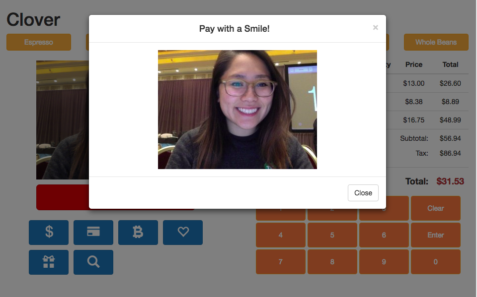

# SmilePay
> *Ditch the cards, pay with your smile*

## Problem/Solution
Everyone has had their morning ruined when you walk into your local coffee house and the line is to the door. You stand there --- annoyed.  You think to yourself, "man, these are the slowest baristas ever!"

Can I let you in on a little secret, the problem isn't that well oiled machine working behind the counter, it's you.  Well not you, because you are always ready to order your medium half calf latte with your credit card in hand, but it is the 20 other people in front of you who fumble through their pockets for some form of payment.

As an operations manager turned engineer I have seen this problem.  I have lived it.  Its painful.

So what do we do?  In a world where cash is no longer the standard and consumers are saturated with payment options how can we take it one step further?  To make it stream-lined and secure for the consumer and fast for the merchant.  Because lets be real, time is transactions and transactions are money.

The solution, Smile Pay.  All you have to do is register for our service, input your payment information and profile picture, and smile.  You can now walk into your favorite places, shop, and pay without the hassle of cash, your phone, or wallet.  Quick, secure, seamless --- allowing you to more with those pearly whites.

## Built With
* node.js
* HTML/CSS with Bootstrap
* JavaScript with jQuery
* ReactNative
* Andriod Studio
* Kairos API, Payeezy API
* CloverPOS

## In Action

*Figure 1*. Web View 1

*Figure 1*. Web View 2

## Contributors
- [Nicholas Davidson](https://github.com/ndavidsonsf)
- [Millie Chan](https://github.com/milliechan)
- [Luis De Castro](https://github.com/holixsf)
- [Kelvin Gann](https://github.com/klvngnn)
- [Aaron Kim](https://github.com/aaronkim5)

## License
This project is licensed under the MIT License - see the [LICENSE.md](LICENSE.md) file for details

